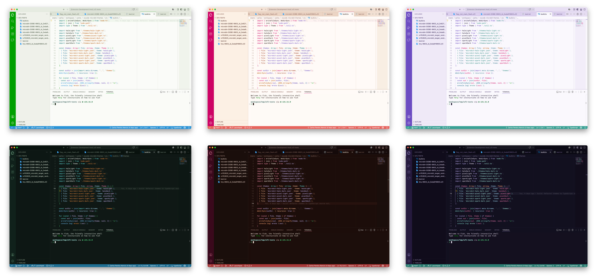

# micro:bit Inspired Themes for VS Code

Six VS Code colour themes inspired by the BBC micro:bit.
**Pixel**, **Spark**, and **Halo**, each in light and dark versions.

## Themes

| Theme                 | Mode  | Chrome pair      |
| --------------------- | ----- | ---------------- |
| micro:bit Pixel Light | Light | Green / Blue     |
| micro:bit Pixel Dark  | Dark  | Green / Blue     |
| micro:bit Spark Light | Light | Red / Orange     |
| micro:bit Spark Dark  | Dark  | Red / Orange     |
| micro:bit Halo Light  | Light | Purple / Teal    |
| micro:bit Halo Dark   | Dark  | Purple / Teal    |

## Install

**From the Marketplace**

1. Open the Extensions view (`⇧⌘X` / `Ctrl+Shift+X`).
2. Search for `micro:bit Themes`.
3. Click **Install**.

## Activate a theme

1. Press `F1` (or `⇧⌘P` / `Ctrl+Shift+P`).
2. Run **Preferences: Color Theme**.
3. Pick any **micro:bit …** entry.

## License

[MIT](LICENSE).

These themes are not affiliated with or endorsed by the Micro:bit
Educational Foundation.
